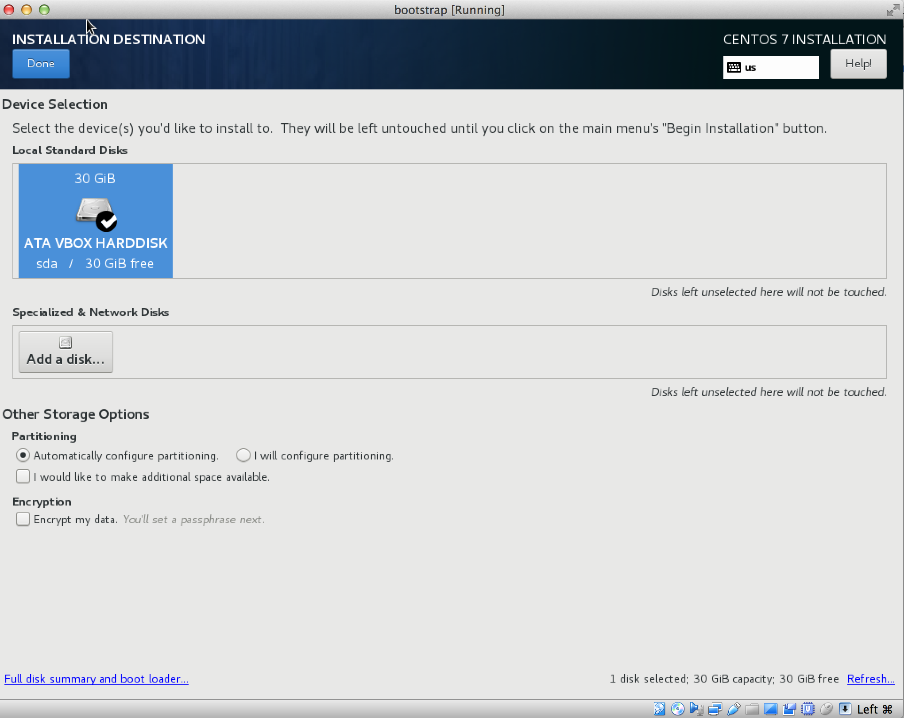

# Virtual Box CentOS7

## 이미지 다운로드

[https://www.centos.org/download/](https://www.centos.org/download/) 에서 Minimal ISO 를 다운받습니다.

## 설치

Virtual Box 를 실행시킨 후, 다음 그림순서대로 설치를 진행하십시오.

---


호스트 네트워크 관리자 선택 후, 호스트 네트워크를 하나 생성 한 후 `DHCP 사용 안함` 을 체크하세요.
`수동으로 어댑터 설정` 선택 후 IPv4 주소를 기억하도록 합니다. 이 주소는 VM 들이 사용할 gateway 주소가 됩니다.

---


새로 만들기를 선택 후 서버 이름, 종류, 버젼을 선택 후 `지금 새 가상 하드 디스크 만들기` 를 선택하세요.

---


VDI 이미지를 선택하고, `동적 할당` 또는 `고정 크기` 를 선택합니다.
 
 - 동적 할당: 가상머신의 파일시스템이 커지는 만큼 동적으로 디스크 공간이 늘어납니다. **주의** 도커 기반 작업 및 구동이 약간 느려질 수 있습니다.
 - 고정 크기: 처음부터 가상머신에 지정된 파일시스템 디스크 공간을 할당합니다. 퍼포먼스에서 이득이 있습니다.

---


각 서버 요구사항에 맞는 cpu core 를 할당합니다.

- **TIP** 버츄얼박스는 반가상화 방식이기 때문에, 개별 VM cpu core 는 호스트 머신의 cpu core 보다 높게 책정할 수 없습니다. (호스트 머신 core 최소 4 이상 필요)
- **TIP** VM 의 코어는 호스트의 core 를 Share 하는 개념이기 때문에, 호스트 머신의 cpu core 수를 넘지 않는다면 vm 을 여러대 생성가능합니다.
  - `4core vm * 4ea && 4 core host => Enable!!`
  - `8core vm * 1ea && 4 core host => False!!`

---


Nat 어댑터, 호스트 온리 어댑터를 선택 후 생성.

- Nat 어댑터: 인터넷 환경의 연결을 담당하는 어댑터 입니다.
- 호스트 온리 어댑터: VM 끼리의 통신을 가능하게 하는 호스트 머신의 가상 네트워크 어댑터입니다.

---


다운로드 받은 ISO 이미지 선택 후 시작버튼을 클릭합니다.

---


Install CentOS 7

---


언어 선택

---


인터넷 카드 모두 선택 후 우측 상단에  `on` 체크 후, `Done` 클릭

---


디스크 선택 후 `Done` 클릭

---


root 패스워드를 설정합니다.

---


centos 유저를 생성 후, 패스워드를 설정합니다.


## VM 네트워크 고정아이피 설정

브리지 어댑터는 공유기에서 할당받은 아이피를 VM 에 할당하게 되는데, VM 을 재부팅 하거나 공유기가 재부팅 될 경우 IP 가 바뀔 소지가 있습니다.

클라우드 플랫폼은 IP 정보로 클러스터 구축이 되기 때문에, DHCP 방식이 아닌 고정아이피를 가져갈 필요가 있습니다.

[네트워크 고정 아이피(옵셔널)](infra/pre-static-ips.md) 섹션을 참조하여 각 VM 의 네트워크 스크립트를 수정하도록 합니다.


## centos 유저 sudo 등록

다음은 centos 유저에 대해 sudo 실행시 패스워드 프롬프트를 생략하도록 설정합니다.

`/etc/sudoers` 퍼미션을 편집가능하게 변경하고, 아래의 내용을 찾아 변경하도록 합니다.

```
$ chmod u+w /etc/sudoers
$ vi /etc/sudoers

.
.
## Allow root to run any commands anywhere
root    ALL=(ALL)       ALL
centos ALL=(ALL) NOPASSWD: ALL

## Allows members of the 'sys' group to run networking, software,
## service management apps and more.
# %sys ALL = NETWORKING, SOFTWARE, SERVICES, STORAGE, DELEGATING, PROCESSES, LOCATE, DRIVERS

## Allows people in group wheel to run all commands
#%wheel ALL=(ALL)       ALL

## Same thing without a password
%wheel  ALL=(ALL)       NOPASSWD: ALL
.
.
```

`/etc/sudoers` 퍼미션을 원복합니다.

```
$ chmod u-w /etc/sudoers
```

