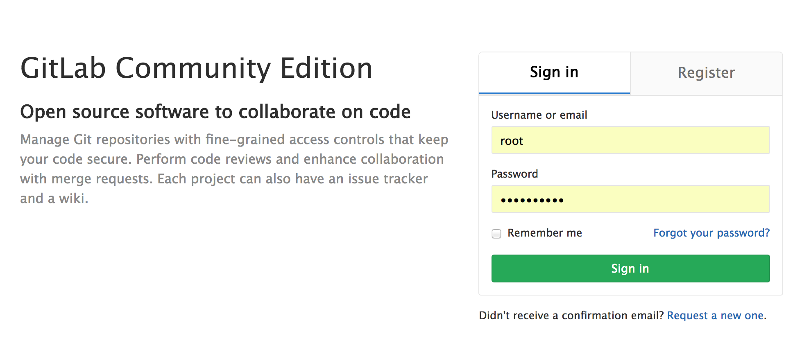
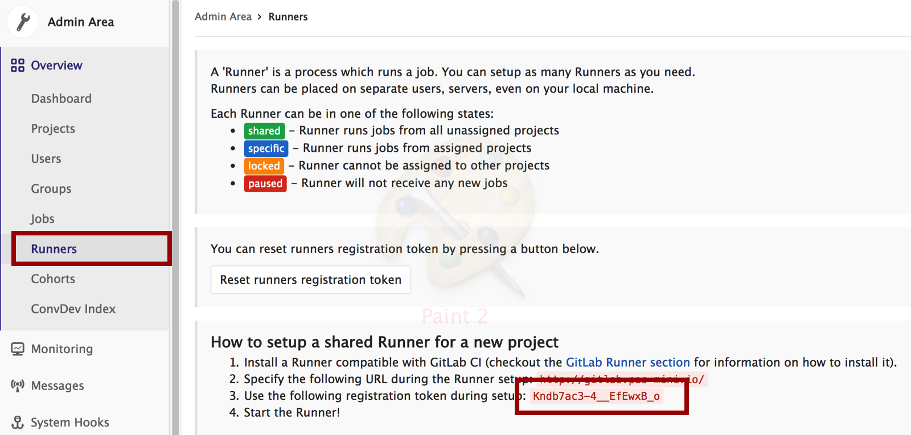
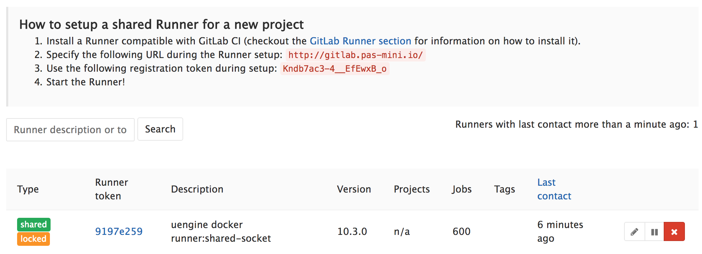

# 깃랩 CI

## 러너 설치

다음은 CI 서버에서 수행하도록 합니다.

깃랩 형상관리 코드로부터 실제 빌드를 수행하려면 Go 로 작성된 **GitLab Runner** 를 설치해야합니다.

.Net, Java, Python, C, PHP 및 기타 프로그래밍 언어를 테스트 할 수 있으며, **GitLab Runner** 에는 
오토 스케일, Docker 지원 및 병렬 작업 기능 등 많은 기능이 있습니다.

다음의 명령어로 간단히 설치가 가능합니다.

```
$ curl -L https://packages.gitlab.com/install/repositories/runner/gitlab-runner/script.rpm.sh | sudo bash

$ sudo yum install gitlab-runner -y
```

### CI 서버를 별도로 준비하는 이유

CI 서버는 고사양일 필요 없이, EC2 기준 `t2.micro (1cpu,1GB)` 로도 충분합니다.
다만, 동시 다발적인 CI 작업이 이루어질 경우, 많은 양의 CI 캐쉬 데이터와 형상관리 코드가 오가게 됨으로, 원한할 네트워크 환경이 필요합니다.

CI 캐쉬 데이터가 필요한 이유는 매번 빌드때마다 `maven, node install` 등의 작업은 오랜 다운로드 시간을 소모하게 되는데, 이러한 시간 소모를 막고자
 빌드 결과물 디렉토리 `ex) m2,node_modules` 를 저장할 수 있기 때문입니다.
    
또한, CI 빌드의 각 스테이지는 독립된 컨테이너에서 실행되게 되는데, 캐쉬 데이터는 스테이지 사이의 빌드 결과물을 가지고 연속된 작업을 가능하게 합니다.
     

    
 - CI 캐쉬 를 클라우드에 저장하지 않고 로컬에 저장할 경우, 충분한 디스크 스페이스를 확보하는걸 추천합니다. 

## 러너 설정

러너와 깃랩을 연동하기 위해서 깃랩 웹 UI 로 접속합니다.

초기 접속 아이디/비밀번호는 `root` , `adminadmin` 입니다.



러너와 깃랩 연동에는 깃랩 서버에서 발급한 토큰이 필요한데, `Admin` 메뉴의 `Overview => Runners` 항목에서 볼 수 있습니다.



위의 그림의 우측 하단 빨간색 박스에 해당하는 것이 러너 등록 토큰입니다.

이 등록토큰을 가지고, CI 서버에서 다음 명령어로 러너를 등록합니다.

```
$ sudo gitlab-ci-multi-runner register -n \
  --url http://gitlab.pas-mini.io\
  --registration-token Kndb7ac3-4__EfEwxB_o \
  --executor docker \
  --description "uengine docker runner:shared-socket" \
  --docker-image "docker:latest" \
  --docker-volumes /var/run/docker.sock:/var/run/docker.sock
```

description 항목에 `uengine docker runner:shared-socket` 으로 등록하셔야 하며, 클라우드 플랫폼은 이 러너를 사용하여 작업을 수행합니다.

생성후에 `/etc/gitlab-runner/config.toml` 파일을 수정할 경우 좀 더 상세한 설정이 가능합니다.

```
concurrent = 5
check_interval = 0
[[runners]]
  name = "uengine docker runner:shared-socket"
  url = "http://gitlab.uengine.io"
  token = "306c411ef28850993d24faa3a05204"
  executor = "docker"
  [runners.docker]
    tls_verify = false
    image = "docker:latest"
    privileged = false
    disable_cache = false
    volumes = ["/root/m2:/root/.m2","/var/run/docker.sock:/var/run/docker.sock", "/cache"]
    shm_size = 0
  [runners.cache]
```

`concurrent` 는 이 러너를 통해 동시에 수행할 수 있는 작업 수를 뜻합니다. 이 항목을 넘어서는 CI 요청이 있을 경우, 깃랩 UI 상에서 해당 작업은 `pending` 
상태에 놓이게 됩니다.

`executor` 는 러커가 실행될 환경을 뜻하는데, docker 로 설정할 경우 완전히 격리된 컨테이너에서 CI 빌드를 수행하게 됩니다.
`executor` 를 docker 로 설정할 경우 `volumes` 또한 **마더 머신(깃랩 서버)** 의 docker 자원과 공유하기 위해 도커 소켓 볼륨을 추가한 모습입니다.
 
설정이 종료된 후에는 다음 명령어로 러너를 재시작합니다.

```
$ sudo gitlab-ci-multi-runner restart
```

`Admin` 메뉴의 `Overview => Runners` 항목에서 다음과 같이 러너가 등록되었다면 절차를 마친 것입니다.




## CI 오토스케일 설정

소규모 단일 팀이나 개인에 의해 운영되는 환경은 Gitlab 서버의 리소스 자원이 충분하다면 문제 될 게 없지만, 그보다 큰 빈번한 커밋 작업이 이루어지게 되는 개발환경에서는 
CI 작업을 단일 서버에서 수행하기에는 무리가 있습니다.

잘 알려진 `jenkins slave` 처럼, 슬레이브 노드 풀을 지정해 놓고 CI 작업 요청을 분산시키는 방식 대신, 깃랩 CI 는 Docker machine 을 통해 CI 요청 수에 따라
 AWS, DigitalOcean, GoogleCloud, VirtualBox, Openstack 등의 다양한 인프라에 필요한 자원을 오토스케일링 하게 됩니다.

**CI 작업 수와 Docker machine 수 의 관계**


이 환경에 대한 문서는 [Autoscale GitLab CI runners and save 90% on EC2 costs](https://about.gitlab.com/2017/11/23/autoscale-ci-runners/)
 과 [Runners autoscale configuration](https://docs.gitlab.com/runner/configuration/autoscale.html#distributed-runners-caching) 에서 
 더 자세히 볼 수 있습니다.

### 도커 머신 설치

```
$ curl -L https://github.com/docker/machine/releases/download/v0.12.2/docker-machine-`uname -s`-`uname -m` >/tmp/docker-machine &&
chmod +x /tmp/docker-machine &&
sudo cp /tmp/docker-machine /usr/local/bin/docker-machine
```

### 캐쉬 저장소 등록

CI 는 기본적으로 자신이 설치된 머신의 디렉토리에 캐쉬 데이터 를 저장하게 됩니다. 하지만, 오토 스케일 환경에서는 도커 머신이 분산배치 되기 때문에, 캐쉬 데이터를 
  주고 받을 수 있는 저장소가 필요합니다.
  
#### S3 storage

다음은 AWS S3 스토리지를 사용한 `/etc/gitlab-runner/config.toml` 설정입니다.
  
```
[[runners]]
.
.
  [runners.cache]
	Type = "s3"
	ServerAddress = "172.31.3.61:9005"
	AccessKey = "AKIAI5U6D*****"
	SecretKey = "uVHmnvl0Kz*****"
	BucketName = "uengine-gitlab-runner"
	BucketLocation = "ap-northeast-2"
```

#### Local cache storage

보안 환경에 따라서 내부에 캐쉬 데이터를 저장해야 하는 경우, 내부적으로 S3 서비스를 설치하여 사용할 수 있습니다. 참조문서 [Install the cache server](https://docs.gitlab.com/runner/install/autoscaling.html#install-the-cache-server)

1. Login to a dedicated machine where the cache server will be running

2. Make sure that Docker Engine is installed on that machine
3. Start [minio](https://www.minio.io/), a simple S3-compatible server written in Go:

```
docker run -it --restart always -p 9005:9000 \
        -v /.minio:/root/.minio -v /export:/export \
        --name minio \
        minio/minio:latest server /export
```

You can modify the port 9005 to expose the cache server on different port.

4. Check the IP address of the server:

```
hostname --ip-address
```

5. Your cache server will be available at `MY_CACHE_IP:9005`

6. Read the Access and Secret Key of minio with: `sudo cat /.minio/config.json`

7. Create a bucket that will be used by the Runner: `sudo mkdir /export/runner`. runner is the name of the bucket in that case. If you choose a different bucket then it will be different

8. All caches will be stored in the /export directory

#### Configure Local cache runner

로컬 캐쉬 서버를 구축 한 후에는, `/etc/gitlab-runner/config.toml` 러너환경에 이 서버를 사용하도록 설정합니다.

```
[[runners]]
.
.
    [runners.cache]
      Type = "s3"
      ServerAddress = "MY_CACHE_IP:9005"
      AccessKey = "ACCESS_KEY"
      SecretKey = "SECRET_KEY"
      BucketName = "runner"
      Insecure = true # Use Insecure only when using with Minio, without the TLS certificate enabled
```

AccessKey 와 SecretKey 는 `sudo cat /.minio/config.json` 에 위치해 있습니다.


### 러너 오토 스케일 설정

참조문서 [Runners autoscale configuration](https://docs.gitlab.com/runner/configuration/autoscale.html#distributed-runners-caching)

본 예제에서는 EC2 환경의 `스팟 인스턴스` 를 CI 풀로 사용하도록 `/etc/gitlab-runner/config.toml` 에 설정한 예입니다.

```
concurrent = 12
check_interval = 0
[[runners]]
  name = "uengine docker runner:shared-socket"
  url = "http://172.31.15.249"
  token = "9197e25967da8c39bc0a826f148464"
  executor = "docker+machine"
  limit = 20
  [runners.docker]
    tls_verify = false
    image = "docker:latest"
    privileged = false
    disable_cache = false
    volumes = ["/var/run/docker.sock:/var/run/docker.sock", "/cache"]
    shm_size = 0
  [runners.machine]
    IdleCount = 1
    MachineDriver = "amazonec2"
    MachineName = "runner-%s"
    MachineOptions = [
    "amazonec2-access-key=AKIAI5U*******",
    "amazonec2-secret-key=uVHmnvl0Kz3sOR1*******",
    "amazonec2-region=ap-northeast-2",
    "amazonec2-instance-type=t2.medium",
    "amazonec2-vpc-id=vpc-e8f91b81",
    "amazonec2-subnet-id=subnet-856487ec",
    "engine-insecure-registry=gitlab.pas-mini.io:5000"
    ]
    IdleTime = 1800
  [runners.cache]
    Type = "s3"
    ServerAddress = "s3.amazonaws.com"
    AccessKey = "AKIAI5U*******"
    SecretKey = "uVHmnvl0Kz3sOR1*******"
    BucketName = "uengine-gitlab-runner"
    BucketLocation = "ap-northeast-2"
```

먼저, `executor` 항목이 `"docker+machine"` 으로 설정한 것을 볼 수 있습니다. 이는 CI 서버에 설치된 도커 머신이 다른 기기에 설치된 도커로 명령을 대리 전달하고,
대리 전달받은 기기의 도커가 부팅되면서 깃랩 소스코드, 캐쉬 데이터를 받아와 작업을 수행하게 됩니다.


`runners.machine` 항목에는 이 도커 머신을 어떻게 띄울 것인가에 대한 기술인데, 도커 머신은 깃랩에 포함된 패키지가 아닌 도커 오피셜 클라이언트입니다.
따라서, 이 항목에는 [공식 도커 머신](https://docs.docker.com/machine/) 을 참조하며 기술하면 됩니다. 지원되는 도커 머신 드라이버 리스트는 다음이 있습니다.

[Amazon Web Services](https://docs.docker.com/machine/drivers/aws/)
[Microsoft Azure](https://docs.docker.com/machine/drivers/azure/)
[Digital Ocean](https://docs.docker.com/machine/drivers/digital-ocean/)
[Exoscale](https://docs.docker.com/machine/drivers/exoscale/)
[Google Compute Engine](https://docs.docker.com/machine/drivers/gce/)
[Generic](https://docs.docker.com/machine/drivers/generic/)
[Microsoft Hyper-V](https://docs.docker.com/machine/drivers/hyper-v/)
[OpenStack](https://docs.docker.com/machine/drivers/openstack/)
[Rackspace](https://docs.docker.com/machine/drivers/rackspace/)
[IBM Softlayer](https://docs.docker.com/machine/drivers/soft-layer/)
[Oracle VirtualBox](https://docs.docker.com/machine/drivers/virtualbox/)
[VMware vCloud Air](https://docs.docker.com/machine/drivers/vm-cloud/)
[VMware Fusion](https://docs.docker.com/machine/drivers/vm-fusion/)
[VMware vSphere](https://docs.docker.com/machine/drivers/vsphere/)
[VMware Workstation](https://github.com/pecigonzalo/docker-machine-vmwareworkstation) (unofficial plugin, not supported by Docker)
[Grid 5000](https://github.com/Spirals-Team/docker-machine-driver-g5k) (unofficial plugin, not supported by Docker)


설정이 종료된 후에는 다음 명령어로 러너를 재시작합니다.

```
$ sudo gitlab-ci-multi-runner restart
```


