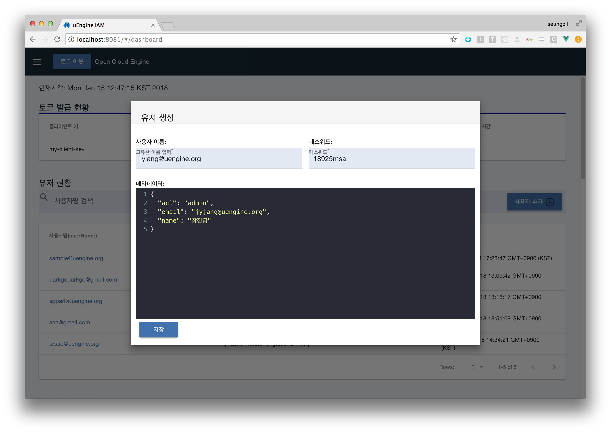

## Local Run && Test

- Check Eureka server is up on localhost:8761

- Check your local Mysql database is set as follow
  
```
spring:
  profiles: local
  jpa:
    hibernate:
      ddl-auto: update
    properties:
      hibernate:
        dialect: org.hibernate.dialect.MySQLDialect
        show_sql: true
  datasource:
    url: jdbc:mysql://localhost:3306/msa
    username: root
    password:
```

- backend

```
mvn package -B
java -jar target/uengine-cloud-iam-1.0-SNAPSHOT.jar
```

- front-end

```
cd front-end
npm install
npm run dev
```

- Move to Browser http://localhost:8081
- Dashboard login id / password is admin / admin (as mentioned in iam.admin.username and password in application.yml)
- Create your test id as follow



- To test login page, type follow url

```
http://localhost:8080/oauth/authorize?client_id=my-client-key&response_type=token&redirect_uri=http%3A%2F%2Flocalhost%3A8081%2F%23%2Flogin%2Fsave&scope=cloud-server&token_type=JWT
```

- And login as your userName ans userPassword
- It will redirect to

```
http://localhost:8081/#/login/save?access_token=eyJhbGciOiJIUzI1NiJ9.eyJpc3MiOiJ1ZW5naW5lLWNsb3VkLWlhbSIsImNvbnRleHQiOnsiY2xpZW50S2V5IjoibXktY2xpZW50LWtleSIsInNjb3BlcyI6WyJjbG91ZC1zZXJ2ZXIiXSwidHlwZSI6InVzZXIiLCJ1c2VyTmFtZSI6Imp5amFuZ0B1ZW5naW5lLm9yZyIsInVzZXIiOnsidXNlck5hbWUiOiJqeWphbmdAdWVuZ2luZS5vcmciLCJtZXRhRGF0YSI6eyJhY2wiOiJhZG1pbiIsImVtYWlsIjoianlqYW5nQHVlbmdpbmUub3JnIiwibmFtZSI6IuyepeynhOyYgSIsImdpdGxhYi1pZCI6NX0sInJlZ0RhdGUiOjE1MTU5ODgwMzk2NzYsInVwZERhdGUiOjE1MTU5ODgwMzk2NzZ9LCJyZWZyZXNoVG9rZW4iOiJjMDMwMmY0MC01NmIzLTQ1YjctODIxNC03MjMwMjgwMGU0ZDcifSwiY2xhaW0iOnt9LCJleHAiOjE1MTU5OTU0MjQsImlhdCI6MTUxNTk4ODIyNH0.AindZMju962nfN6nWU5lKcS9v4SoLGbHtCy14v1uAos&scope=cloud-server&state=null&token_type=JWT&expires_in=7200
```

That means,

1. Your application has http://localhost:8081/#/login/save
2. You should parse get parameter "access_token"
3. Save in your localStorage "access_token"

## Build

```
cd front-end
npm run build

cd ../
mvn package -B
```

## Docker build && upload

```
docker login

type to login prompt sppark / gosu23546

REGISTRY_URL=sppark
docker build -t $REGISTRY_URL/uengine-cloud-iam:v1 ./
docker push $REGISTRY_URL/uengine-cloud-iam:v1
```

## Deploy to DC-OS cluster

```
Move to DCOS [http://dcos.pas-mini.io/](http://dcos.pas-mini.io/)

Select Google accoutn, login as your cloud plaform email address (ex. jyjang@uengine.org)

Restart "uengine-cloud-iam" in Service Menu
```